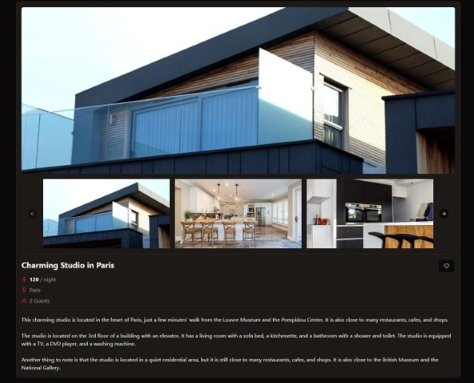
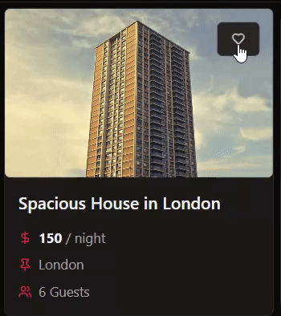
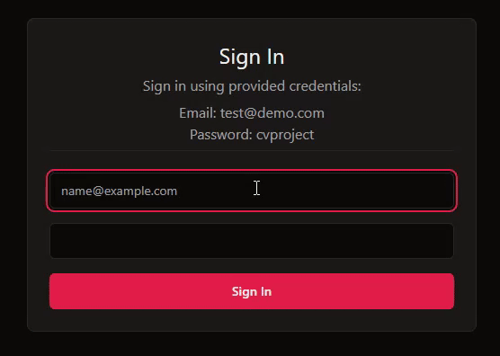
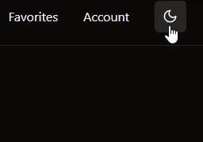
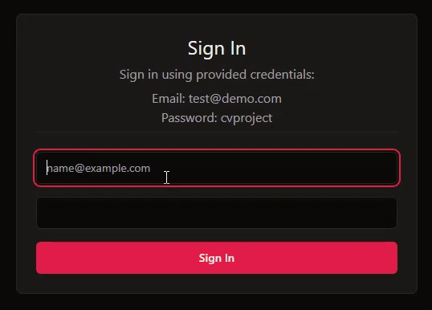

# CVProject
[View the Project](https://cv-project-ruby.vercel.app/)

A simplified website inspired by Booking.com, allowing users to search for offers based on filters, browse them, and add to favorites. The project is fully written in TypeScript and React, with state management handled by Redux. It features a login functionality, dark mode, and form validation using Zod. The backend is mocked and stored in local storage using axios-mock-adapter.

## Features

- **Search Offers**: Filter offers based on various criteria.
  
 
  
- **Browse Offers**: View detailed information about offers.

 
  
- **Add to Favorites**: Save favorite offers for quick access.
  
  
  
- **Login Functionality**: Secure login using specific credentials.

 
  
- **Dark Mode**: Switch between light and dark themes.

 

- **Form Validation**: Validate forms using Zod library.

 

- **Mocked Backend**: Use axios-mock-adapter to mock API responses and store data in local storage.

## Setup and Installation

1. Clone the repository:

   ```bash
   git clone https://github.com/Kerlitto/CVProject.git
   ```

2. Navigate to the project directory:

   ```bash
   cd CVProject
   ```

3. Install dependencies:

   ```bash
   npm install
   ```

4. Run the development server:

   ```bash
   npm run dev
   ```

5. Open your browser and visit `http://localhost:3000` to see the application in action.

## Demo Credentials

- **Email**: test@demo.com
- **Password**: cvproject

## Contact

Maciej Kozak  
Email: maciej_kozak@wp.pl

## Technologies and Libraries Used

### Core Technologies

- **React**: The entire front-end is built using React, leveraging its component-based architecture to create a dynamic and responsive user interface. React's virtual DOM enhances performance and provides a seamless user experience.
- **TypeScript**: TypeScript is used throughout the project to provide type safety and enhance code quality. TypeScript's static typing helps catch errors early in the development process and makes the codebase more maintainable and scalable.

- **Redux**: State management is handled by Redux, ensuring that the application's state is managed predictably and efficiently. Redux Toolkit is used to simplify the setup and management of Redux, providing powerful tools like slices and the `createAsyncThunk` function for handling asynchronous actions.

### Dependencies

- `@emotion/react`: ^11.11.4
- `@emotion/styled`: ^11.11.5
- `@hookform/resolvers`: ^3.6.0
- `@mui/material`: ^5.15.20
- `@radix-ui/react-dropdown-menu`: ^2.0.6
- `@radix-ui/react-label`: ^2.0.2
- `@radix-ui/react-popover`: ^1.1.1
- `@radix-ui/react-separator`: ^1.0.3
- `@radix-ui/react-slot`: ^1.0.2
- `@reduxjs/toolkit`: ^2.2.5
- `axios`: ^1.7.2
- `axios-mock-adapter`: ^1.22.0
- `class-variance-authority`: ^0.7.0
- `clsx`: ^2.1.1
- `date-fns`: ^3.6.0
- `embla-carousel-react`: ^8.1.5
- `jose`: ^5.5.0
- `js-cookie`: ^3.0.5
- `lucide-react`: ^0.379.0
- `react`: ^18.2.0
- `react-day-picker`: ^8.10.1
- `react-dom`: ^18.2.0
- `react-hook-form`: ^7.52.0
- `react-redux`: ^9.1.2
- `react-router-dom`: ^6.23.1
- `tailwind-merge`: ^2.3.0
- `tailwindcss-animate`: ^1.0.7
- `zod`: ^3.23.8
